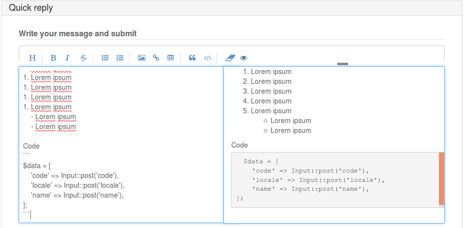

# Example install [runbb-ext-markitup](https://github.com/runcmf/runbb-ext-markitup) plugin 

**1.**
go to Administration -> Plugins -> repo -> find `markItup based markdown editor toolbar with elFinder` -> click `composer >`    

`in first run composer will be downloaded and unpacked. You see it in modal 'Console Output:'`  

after you see `Ready. All commands are available.`  
click green button with `require runcmf/runbb-ext-markitup`  

**2.**   
after close modal, page refreshed and you see `markItup based markdown editor toolbar with elFinder` **installed**  

go to Administration -> Plugins -> `markItUp Toolbar` -> `Activate`

**3.**  add elfinder container to skins near `<textarea`. for example topic.php `<form id="quickpostform"`
```html
<textarea name="req_message" id="req_message" ... bla-bla-bla
<div id="markitup-elfinder"></div>
```




